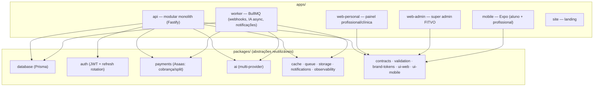

# FITVO

**SaaS multi-especialidade de saúde e fitness — "3 apps em 1".** Reúne
**treino**, **nutrição** e **medicina** na mesma base técnica, com contextos
separados por especialidade e dados do paciente interligados sob consentimento.
Vendável para o **profissional solo** e para a **clínica** (que centraliza
atendimentos, dados e financeiro na plataforma), com operação de pagamentos
embutida.

> **Estado:** em construção. O backend (API) é a parte viva; web e mobile ainda
> são placeholders. Este repositório é **público e serve de portfólio** — a ênfase
> está na engenharia: arquitetura documentada, decisões rastreáveis e gates de
> qualidade. Ver [Estado do projeto](#estado-do-projeto).

---

## Por que este repositório é interessante

Não é um tutorial abandonado. É um sistema modelado como produto real:

- **14 ADRs** ([`docs/adr/`](docs/adr/README.md)) documentando cada decisão de
  arquitetura com **contexto, alternativas rejeitadas e consequências** — 132
  decisões (D-001 a D-132) mapeadas para o ADR onde vivem.
- **CI com 8 gates** obrigatórios (lint, typecheck, test, build, format,
  migrate+drift, dependency-scan, secret-scan) + branch protection na `main`.
- **[Política de Merge](CLAUDE.md#política-de-merge--revisão-humana-obrigatória-em-áreas-críticas)**:
  áreas de risco (financeiro, consentimento, auth, dado clínico, migrations
  destrutivas) exigem revisão humana — CI verde não basta.
- **[Troubleshooting](docs/troubleshooting.md)** com armadilhas reais de
  integração (Asaas, Prisma, Postgres/porta, Redis obrigatório) — o custo já
  pago, versionado.
- **Higiene de segredos** tratada como prioridade (gitleaks no CI e no
  pre-commit, `.gitignore`/`.gitleaks.toml` versionados) porque o repo é público.

## Arquitetura

**Modular Monolith** (não microservices). A API é organizada por **vertical
slice**: cada domínio é autocontido (domínio / aplicação / infra / interface),
com baixo acoplamento e alta coesão — extraível para serviço no futuro sem
refatoração. Tudo reutilizável vive em `packages/`; o domínio nunca depende de
tecnologia concreta, só da interface do package de abstração.



Detalhe da estrutura do monorepo e das convenções em
[CLAUDE.md](CLAUDE.md#estrutura-do-monorepo).

## Stack

| Camada | Tecnologias |
|---|---|
| **Linguagem** | TypeScript (strict) |
| **Monorepo** | Turborepo + pnpm workspaces |
| **Backend** | Node.js · Fastify · Prisma · PostgreSQL · Redis · BullMQ · JWT · Zod · Swagger/OpenAPI |
| **Web** | Next.js · React · TailwindCSS · TanStack Query · React Hook Form · Zod |
| **Mobile** | React Native · Expo (Expo Router, TanStack Query) |
| **Infra** | S3-compatible (storage) · Redis (cache/filas) · Vercel (front) · Railway (back) |
| **Integrações** | Asaas (pagamentos/split) · OpenAI/Anthropic (via abstração) · Firebase (push) |
| **Qualidade** | ESLint · Prettier · Husky · lint-staged · commitlint · gitleaks · Vitest |

## Como rodar (local)

```bash
nvm use                                                   # Node >= 22.12 (.nvmrc)
pnpm install
cp .env.example .env                                      # e os .env.example de cada app
docker compose -f docker/docker-compose.yml up -d         # postgres (5434) + redis (6379)
pnpm --filter @fitvo/database db:migrate                  # aplica o schema + gera o Prisma Client
pnpm --filter @fitvo/api dev                              # API em http://localhost:3333 (Swagger em /docs)
```

Precisam estar no ar: **Postgres (5434)**, **Redis (6379)** e a **API (3333)**.

> ⚠️ **Redis é obrigatório, não opcional.** Sem ele a API **sobe** e escuta na
> 3333, mas **`/v1/auth/login` e `/refresh` quebram** — a sessão (refresh token)
> vive no Redis. O sintoma engana: _"a API subiu, o login não funciona"_.
>
> ⚠️ **O Postgres local roda na 5434, não na 5432.** A 5432 costuma estar ocupada
> por um Postgres **nativo** (comum no macOS): o container sobe sem conflito
> aparente, mas `localhost:5432` cai no banco errado (`P1000: Authentication
> failed` com a credencial correta).

Essas e outras armadilhas (Node antigo no shell, `npx prisma` puxando a major
errada, split do Asaas) estão em **[docs/troubleshooting.md](docs/troubleshooting.md)**,
com sintoma e causa.

### Primeiro login (não há seed)

Registre um profissional — o registro já abre sessão e devolve os tokens (a
verificação de e-mail **não** bloqueia o login nesta fase; o token de
verificação/reset não é exposto e não é necessário para exercitar a API — o
registro e o login já devolvem os tokens de acesso).

```bash
# Registra e já retorna { account, tokens } (documentType: CPF = 11 dígitos)
curl -sS -X POST http://localhost:3333/v1/auth/register/professional \
  -H 'content-type: application/json' \
  -d '{"email":"dev@fitvo.local","password":"senha-forte-123","name":"Dev",
       "document":"12345678901","documentType":"CPF","tenantName":"Clinica Dev"}'

# Login subsequente
curl -sS -X POST http://localhost:3333/v1/auth/login \
  -H 'content-type: application/json' \
  -d '{"email":"dev@fitvo.local","password":"senha-forte-123"}'
```

## Documentação

| Documento | O que é |
|---|---|
| [docs/adr/](docs/adr/README.md) | **Architecture Decision Records** — a fonte viva das decisões (índice + mapa D→ADR). |
| [docs/roadmap.md](docs/roadmap.md) | Plano de execução: feito, em andamento, pendente, bloqueado. Fonte única do plano. |
| [docs/design-system.md](docs/design-system.md) | Design system (tokens, primitivos). Cores atuais são provisórias. |
| [docs/troubleshooting.md](docs/troubleshooting.md) | Armadilhas reais de ambiente e integração, com sintoma e causa. |
| [CLAUDE.md](CLAUDE.md) | Referência permanente do repo: missão, stack, padrões, Política de Merge. |
| [CONTRIBUTING.md](CONTRIBUTING.md) | Conventional Commits, branches, PRs, regras de segurança. |

## Estado do projeto

**Existe (na `main`, com PR e CI verde):**

- Fundação técnica: monorepo, tooling, CI (8 gates), Docker, envs, esqueleto dos
  packages de abstração.
- **Backend / API**: autenticação e identidade (Argon2 + JWT + refresh rotation),
  clínica & convites, paciente & vínculo (`Bond`), consentimento + motor de
  compartilhamento, financeiro núcleo (Plan/Subscription/Charge/split, webhook,
  adapter Asaas), esqueletos de schema dos domínios de conteúdo.
- Design tokens (`brand-tokens`) e primitivos de UI (`ui-web`/`ui-mobile`) com testes.

**Ainda não existe:**

- Web (`web-personal`, `web-admin`, `site`) e `mobile` são **placeholders** — o
  painel `web-personal` (login/shell/tema) está em PR aberto, não mergeado.
- Detalhe fino dos domínios de conteúdo (nutrição/medicina seguem em `detail
  Json?` no schema até o lote de implementação de cada uma).
- Integrações ao vivo (Asaas em produção, preços comerciais, texto jurídico) —
  **gated** por credenciais/decisão do responsável.
- Design system final e identidade visual — bloco de design próprio.

O plano completo, com ordem e bloqueios, está em
[docs/roadmap.md](docs/roadmap.md).

## Licença

Software proprietário — **todos os direitos reservados**. O código é público para
**avaliação e portfólio**; não há concessão de uso, cópia, modificação ou
distribuição. Ver [LICENSE](LICENSE).
